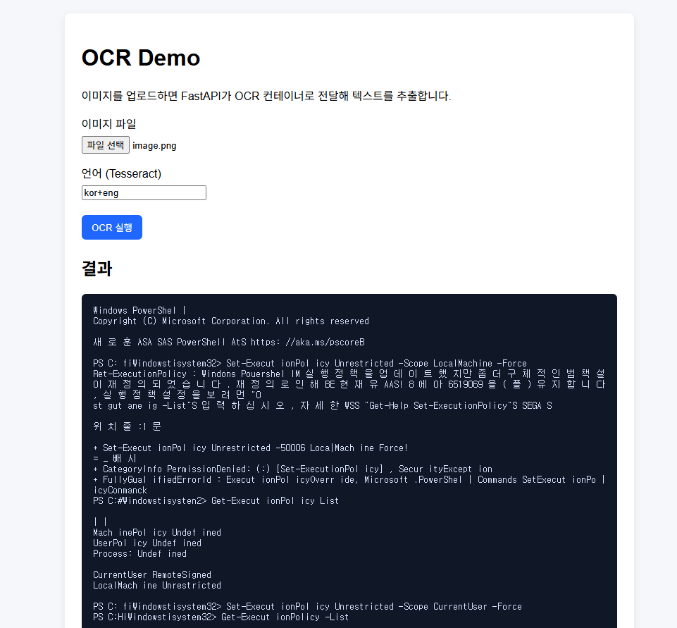

# Docker Compose Tesseract OCR (WSL + FastAPI + Vanilla JS)

이 저장소는 아래 3개 컨테이너를 Docker Compose로 묶어, **WSL2 리눅스 환경에서 바로 실행 가능한 OCR 웹 서비스**를 제공합니다.



- **ocr-service**: Tesseract OCR 엔진 컨테이너 (`jitesoft/tesseract-ocr`) + FastAPI 래퍼
- **backend**: 업로드 파일을 OCR 서비스로 전달하는 FastAPI API Gateway
- **frontend**: 바닐라 JavaScript 업로드 UI (Nginx 정적 서버)

---

## 1) 기술 스택 (상세)

### 인프라 / 컨테이너
- **Docker / Docker Compose v2**
- **WSL2 (Ubuntu 권장)**
- 컨테이너간 통신은 Compose 기본 네트워크 DNS(`ocr-service`) 사용

### OCR 엔진
- **Tesseract OCR** (base image: `jitesoft/tesseract-ocr:latest`)
- OCR API는 Python FastAPI로 감싸서 HTTP 업로드 기반 처리
- 내부적으로 `subprocess`로 `tesseract  stdout -l <lang>` 실행

### Backend API
- **Python 3.11**
- **FastAPI** + **Uvicorn**
- **httpx**로 OCR 컨테이너에 멀티파트 업로드 전달
- CORS 허용(데모 목적)

### Frontend
- **Vanilla JavaScript**
- **HTML + CSS**
- `fetch + FormData`로 이미지 업로드
- 별도 프레임워크(React/Vue 등) 없이 경량 구성

---

## 2) 아키텍처

```text
Browser (http://localhost:5173)
        │
        │ POST /api/ocr (multipart/form-data)
        ▼
Backend FastAPI (http://localhost:8000)
        │
        │ POST /ocr?lang=kor+eng
        ▼
OCR Service FastAPI (internal: ocr-service:8001)
        │
        │ subprocess: tesseract image stdout -l kor+eng
        ▼
Recognized Text
```

---

## 3) WSL2 리눅스 환경 실행 가이드

> 아래 예시는 **Windows + WSL2(Ubuntu)** 기준입니다.

### 3-1. 사전 준비

1. Docker Desktop 설치
2. Docker Desktop 설정에서 **Use WSL 2 based engine** 활성화
3. Docker Desktop > Settings > Resources > WSL Integration 에서 사용 중인 배포판(Ubuntu) 활성화

WSL 터미널에서 확인:

```bash
docker --version
docker compose version
```

### 3-2. 프로젝트 실행

```bash
# 1) repo 이동
cd /workspace/Docker-compose-Tesseract-OCR

# 2) 빌드 + 실행
docker compose up --build -d

# 3) 상태 확인
docker compose ps
```

---
```
root@DESKTOP-D6A344Q:/home/Docker-compose-Tesseract-OCR# docker exec -it ocr-service sh -lc "ls -al /usr/local/share/tessdata | egrep 'kor|eng' || true"
-rw-r--r-- 1 tesseract tesseract  4113088 Feb 19 04:19 eng.traineddata
-rw-r--r-- 1 root      root      15317715 Feb 21 12:59 kor.traineddata
```

### 3-3. 접속 URL

- Frontend: http://localhost:5173
- Backend health: http://localhost:8000/health
- Backend docs: http://localhost:8000/docs

---

## 4) 사용 방법 (이미지 업로드)

1. 브라우저에서 `http://localhost:5173` 접속
2. 이미지 파일 선택
3. 언어코드 입력 (기본: `kor+eng`)
4. **OCR 실행** 버튼 클릭
5. 하단 결과 박스에서 텍스트 확인

---

## 5) API 명세

### Backend

#### `GET /health`
- 백엔드 상태 확인

#### `POST /api/ocr?lang=kor+eng`
- form-data:
  - `file`: 업로드 이미지
- 응답(JSON):

```json
{
  "text": "인식된 텍스트",
  "lang": "kor+eng",
  "filename": "sample.png"
}
```

### OCR Service (내부용)

#### `POST /ocr?lang=kor+eng`
- multipart 이미지 수신 후 Tesseract 실행
- 결과 텍스트 반환

---

## 6) 주요 파일 구조

```text
.
├─ docker-compose.yml
├─ .gitignore
├─ readme.md
├─ backend/
│  ├─ Dockerfile
│  ├─ requirements.txt
│  └─ main.py
├─ ocr-service/
│  ├─ Dockerfile
│  ├─ requirements.txt
│  └─ app.py
└─ frontend/
   ├─ Dockerfile
   ├─ nginx.conf
   ├─ index.html
   ├─ styles.css
   └─ app.js
```

---

## 7) 운영/개발 팁

- OCR 언어는 Tesseract language data 설치 여부에 따라 달라집니다.
- `kor` 미지원 시 `eng`로 먼저 테스트하세요.
- 로그 확인:

```bash
docker compose logs -f backend
docker compose logs -f ocr-service
docker compose logs -f frontend
```

- 종료/정리:

```bash
docker compose down
```

---

## 8) 트러블슈팅

### Q1. `502 OCR 서비스 연결 실패`
- `ocr-service` 컨테이너 정상 기동 여부 확인: `docker compose ps`
- `docker compose logs ocr-service`에서 Python/FastAPI 에러 확인

### Q2. 한글 인식이 잘 안됨
- 이미지 품질(DPI, 명암, 왜곡) 개선
- 언어코드 변경 (`kor`, `kor+eng`, `eng`) 비교

### Q3. WSL에서 포트 접근이 안됨
- Docker Desktop이 실행 중인지 확인
- WSL integration 활성화 확인
- 충돌 포트(5173/8000) 점유 여부 확인

